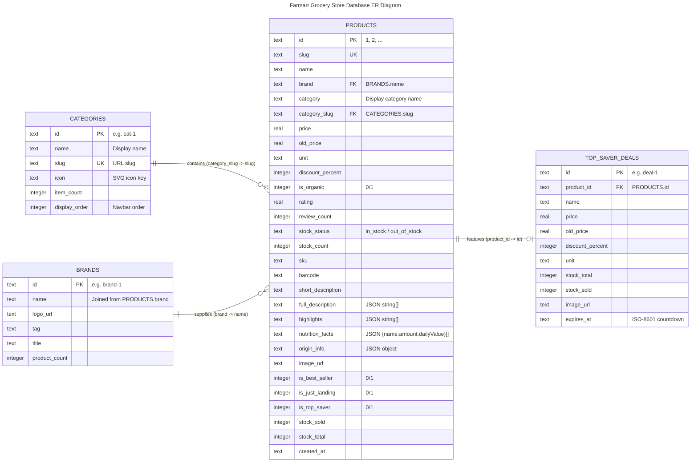

# Farmart database overview

- **Engine:** SQLite 3 via `better-sqlite3`, `journal_mode = WAL`
- **File:** `data/farmart.db` (created automatically — see the `seed-data` skill)
- **Connection:** `getDb()` singleton in [src/lib/db.ts](../../../src/lib/db.ts)
- **Schema source of truth:** `CREATE TABLE IF NOT EXISTS` statements in [src/lib/seed.ts](../../../src/lib/seed.ts)
- **Full data dictionary / DDL:** [DATABASE.md](../../../DATABASE.md) · interactive ERD: [mermaid.html](../../../mermaid.html)

## ER diagram



## Things the diagram can't show

- **FKs are logical, not enforced.** `seed.ts` declares no `FOREIGN KEY` / `REFERENCES`
  constraints; the relationships above are joins by convention. `products.brand` joins on
  `brands.name` (not `brands.id`).
- **JSON columns** (`full_description`, `highlights`, `nutrition_facts`, `origin_info`) are
  stored as TEXT — `JSON.parse` them in route handlers before returning.
- **Booleans** are `INTEGER` 0/1.
- `products.category` duplicates `categories.name` (denormalised for display).

## Table → API route map

| Table | Read by |
| :--- | :--- |
| `categories` | `app/api/categories/route.ts`, `app/api/categories/[slug]/route.ts` |
| `brands` | `app/api/brands/route.ts` |
| `products` | `app/api/products/route.ts`, `products/[id]`, `products/[id]/related`, `products/best-sellers`, `products/just-landing` |
| `top_saver_deals` | `app/api/deals/top-saver/route.ts` |

Verify before relying on this map: `grep -rn "FROM <table>" app/api`.

## Keeping this in sync (required on every feature that touches data)

When a feature adds/removes/renames a table, column, index, or relationship — or adds a route
that reads a table — update **all** of these in the same change:

1. `src/lib/seed.ts` — `CREATE TABLE` + seed rows (existing dev dbs won't pick up new columns
   automatically; see the `seed-data` skill for re-seeding).
2. **This skill** — the `erDiagram` block, the caveats, and the table → route map.
3. `DATABASE.md` — ER diagram, data dictionary, DDL, and seed counts.
4. `mermaid.html` — the `erDiagram` definitions inside it.
5. `app/api/openapi.json` / `src/data/openapi.json` if response shapes change.

Quick drift check — the column lists in the diagram should match the live db:

```bash
sqlite3 data/farmart.db ".schema"
```
