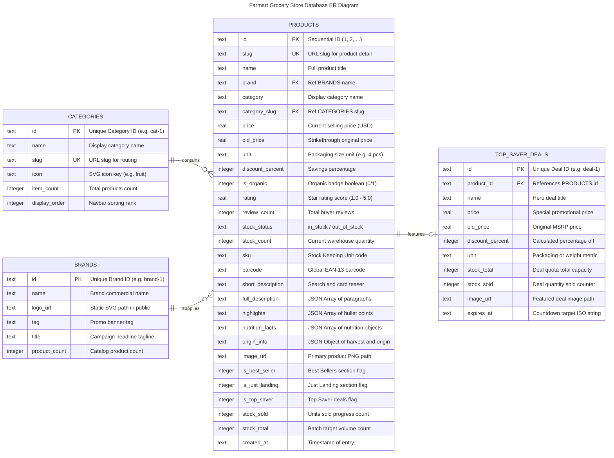

# 🗄️ เอกสารสถาปัตยกรรมฐานข้อมูล (Database Architecture & Schema Documentation)

เอกสารนี้ระบุรายละเอียดโครงสร้างฐานข้อมูล SQLite ของระบบ **Farmart Online Grocery Store** ที่ใช้งานอยู่ในปัจจุบัน โดยครอบคลุมทั้ง Mermaid ER Diagram, คำอธิบายฟิลด์ข้อมูลในแต่ละตาราง (Data Dictionary), ความสัมพันธ์ระหว่าง Entity (Relationships) ตลอดจน DDL Schema และสถิติข้อมูลจำลอง (Seed Data)

---

## 1. ผังโครงสร้างความสัมพันธ์ (Mermaid Entity Relationship Diagram)



> **หน้าเว็บ Interactive ERD**: สามารถเปิดดูผังแบบโต้ตอบ ซูม/ย้ายได้ผ่านไฟล์ [`mermaid.html`](file:///Users/saritplewma/Desktop/practice/ai-sdlc-course/mermaid.html) หรือทางเบราว์เซอร์ที่ `http://localhost:3000/mermaid.html`

---

## 2. ข้อมูลภาพรวมของระบบฐานข้อมูล (Database Overview)

| คุณสมบัติ (Property) | รายละเอียด (Details) |
| :--- | :--- |
| **ฐานข้อมูล (Database Engine)** | SQLite 3 (`better-sqlite3` v13.0.3) |
| **โหมดการเขียน (Journal Mode)** | `WAL` (Write-Ahead Logging) เพื่อรองรับ Concurrent Read/Write ประสิทธิภาพสูง |
| **ที่จัดเก็บไฟล์ (File Location)** | [`data/farmart.db`](file:///Users/saritplewma/Desktop/practice/ai-sdlc-course/data/farmart.db) |
| **การจัดการ Connection** | Global Singleton Pattern เพื่อรองรับ Next.js Fast Refresh & Hot Reload |
| **จำนวนตารางทั้งหมด** | 4 ตารางหลัก (`categories`, `brands`, `products`, `top_saver_deals`) |
| **จำนวนข้อมูล Master Seed** | รวม 31 รายการ (หมวดหมู่ 8 รายการ, แบรนด์ 4 รายการ, สินค้า 15 รายการ, โปรโมชัน 4 รายการ) |

---

## 3. พจนานุกรมข้อมูล (Data Dictionary & Column Specifications)

### 3.1 ตาราง `categories` (หมวดหมู่สินค้าหลัก)
จัดเก็บข้อมูลหมวดหมู่สินค้าสำหรับการแสดงผลใน Navbar, Dropdown และหน้าค้นหาสินค้า

| ชื่อคอลัมน์ (Column) | ประเภทข้อมูล (Type) | ข้อจำกัด (Constraints) | คำอธิบาย (Description) | ตัวอย่างข้อมูล (Example) |
| :--- | :--- | :--- | :--- | :--- |
| `id` | `TEXT` | `PRIMARY KEY` | รหัสหมวดหมู่แบบเฉพาะเจาะจง | `'cat-1'` |
| `name` | `TEXT` | `NOT NULL` | ชื่อหมวดหมู่สินค้าที่แสดงผลบน UI | `'Fruits & Vegetables'` |
| `slug` | `TEXT` | `UNIQUE NOT NULL` | สลักสำหรับ URL routing และ query parameters | `'fruits-vegetables'` |
| `icon` | `TEXT` | `NULLABLE` | รหัสอ้างอิงไอคอน SVG ของหมวดหมู่ | `'fruit'` |
| `item_count` | `INTEGER` | `DEFAULT 0` | จำนวนสินค้าทั้งหมดในหมวดหมู่นี้ | `154` |
| `display_order` | `INTEGER` | `DEFAULT 0` | ลำดับการจัดเรียงบน Navbar และ Grid | `1` |

---

### 3.2 ตาราง `brands` (แบรนด์และผู้ผลิตพันธมิตร)
จัดเก็บข้อมูลแบรนด์พันธมิตรสำหรับแสดงใน Banner แนะนำ และ Filter ในหน้าค้นหา

| ชื่อคอลัมน์ (Column) | ประเภทข้อมูล (Type) | ข้อจำกัด (Constraints) | คำอธิบาย (Description) | ตัวอย่างข้อมูล (Example) |
| :--- | :--- | :--- | :--- | :--- |
| `id` | `TEXT` | `PRIMARY KEY` | รหัสประจำแบรนด์ | `'brand-1'` |
| `name` | `TEXT` | `NOT NULL` | ชื่อแบรนด์ทางการค้า | `'Farmart Organic Direct'` |
| `logo_url` | `TEXT` | `NULLABLE` | พาธไฟล์ภาพ SVG โลโก้ในโฟลเดอร์ `public/` | `'/images/brands/farmart.svg'` |
| `tag` | `TEXT` | `NULLABLE` | ป้ายกำกับข้อความโปรโมชันเด่น | `'FARMART'` |
| `title` | `TEXT` | `NULLABLE` | สโลแกนโปรโมชันของแบรนด์ | `'Fresh Meat Sausage. BUY 2 GET 1'` |
| `product_count`| `INTEGER` | `DEFAULT 0` | จำนวนสินค้าของแบรนด์ที่วางจำหน่าย | `32` |

---

### 3.3 ตาราง `products` (แค็ตตาล็อกสินค้า)
จัดเก็บรายละเอียดสินค้าครบถ้วน พร้อมข้อมูลโภชนาการ แหล่งที่มา และรูปภาพความละเอียดสูง

| ชื่อคอลัมน์ (Column) | ประเภทข้อมูล (Type) | ข้อจำกัด (Constraints) | คำอธิบาย (Description) |
| :--- | :--- | :--- | :--- |
| `id` | `TEXT` | `PRIMARY KEY` | รหัสระบุสินค้า (เช่น `'1'`, `'2'`) |
| `slug` | `TEXT` | `UNIQUE NOT NULL` | URL Slug เฉพาะสำหรับหน้ารายละเอียดสินค้า |
| `name` | `TEXT` | `NOT NULL` | ชื่อเต็มของสินค้า |
| `brand` | `TEXT` | `NOT NULL` | แบรนด์ผู้ผลิต (เชื่อมโยงกับ `brands.name`) |
| `category` | `TEXT` | `NOT NULL` | ชื่อหมวดหมู่สำหรับแสดงผล |
| `category_slug` | `TEXT` | `NOT NULL` | Slug หมวดหมู่ (เชื่อมโยงกับ `categories.slug`) |
| `price` | `REAL` | `NOT NULL` | ราคาขายปัจจุบัน (หน่วย USD) |
| `old_price` | `REAL` | `NULLABLE` | ราคาเดิมก่อนลดราคา |
| `unit` | `TEXT` | `NOT NULL` | หน่วยบรรจุภัณฑ์ เช่น `'4 pcs (~650g)'`, `'500ml'` |
| `discount_percent` | `INTEGER` | `DEFAULT 0` | เปอร์เซ็นต์ส่วนลด |
| `is_organic` | `INTEGER` | `DEFAULT 0` | สถานะสินค้าออร์แกนิก (0 = ไม่ใช่, 1 = ใช่) |
| `rating` | `REAL` | `DEFAULT 5.0` | คะแนนรีวิวเฉลี่ย (1.0 - 5.0) |
| `review_count` | `INTEGER` | `DEFAULT 0` | จำนวนรีวิวจากลูกค้า |
| `stock_status` | `TEXT` | `DEFAULT 'in_stock'` | สถานะสินค้าในคลัง (`'in_stock'`, `'out_of_stock'`) |
| `stock_count` | `INTEGER` | `DEFAULT 50` | จำนวนสินค้าคงเหลือในสต็อก |
| `sku` | `TEXT` | `NULLABLE` | รหัสสินค้า SKU (เช่น `'FM-ORG-AVO-04'`) |
| `barcode` | `TEXT` | `NULLABLE` | รหัสบาร์โค้ดสากล EAN-13 |
| `short_description` | `TEXT` | `NULLABLE` | ข้อความสรุปสินค้าแบบสั้น |
| `full_description` | `TEXT (JSON)` | `NULLABLE` | อาร์เรย์ของย่อหน้าคำอธิบายสินค้าแบบละเอียด |
| `highlights` | `TEXT (JSON)` | `NULLABLE` | อาร์เรย์จุดเด่นสินค้า |
| `nutrition_facts` | `TEXT (JSON)` | `NULLABLE` | โภชนาการ `[{name, amount, dailyValue}]` |
| `origin_info` | `TEXT (JSON)` | `NULLABLE` | แหล่งกำเนิด `{farmName, location, harvestDate, shelfLife}` |
| `image_url` | `TEXT` | `NULLABLE` | พาธภาพสินค้า PNG เช่น `'/images/products/avocado.png'` |
| `is_best_seller` | `INTEGER` | `DEFAULT 0` | แฟล็กแสดงในแท็บ Best Sellers (0/1) |
| `is_just_landing` | `INTEGER` | `DEFAULT 0` | แฟล็กแสดงในแท็บ Just Landing (0/1) |
| `is_top_saver` | `INTEGER` | `DEFAULT 0` | แฟล็กแสดงในแท็บ Top Saver Today (0/1) |
| `stock_sold` | `INTEGER` | `DEFAULT 0` | จำนวนชิ้นที่จำหน่ายไปแล้ว |
| `stock_total` | `INTEGER` | `DEFAULT 100` | โควตาจำนวนชิ้นทั้งหมดสำหรับคำนวณ Progress bar |
| `created_at` | `TEXT` | `DEFAULT CURRENT_TIMESTAMP` | เวลาบันทึกข้อมูลเข้าระบบ |

#### โครงสร้างฟิลด์แบบ JSON (JSON Schema Examples in `products`):
```json
// nutrition_facts
[
  { "name": "Serving Size", "amount": "1/2 Avocado (80g)" },
  { "name": "Calories", "amount": "130 kcal", "dailyValue": "7%" },
  { "name": "Total Fat", "amount": "12g", "dailyValue": "15%" }
]

// origin_info
{
  "farmName": "Green Valley Regenerative Cooperative",
  "location": "Chiang Mai Highlands, Thailand",
  "harvestDate": "Yesterday morning (06:30 AM)",
  "storageTemp": "12°C - 15°C (Cool Pantry)",
  "shelfLife": "5 to 7 days from delivery date"
}
```

---

### 3.4 ตาราง `top_saver_deals` (ดีลลดราคาพิเศษประจำวัน)
จัดเก็บรายการสินค้าลดราคาพิเศษที่แสดงในเซกชัน Top Saver Today พร้อมเวลานับถอยหลัง (Countdown)

| ชื่อคอลัมน์ (Column) | ประเภทข้อมูล (Type) | ข้อจำกัด (Constraints) | คำอธิบาย (Description) |
| :--- | :--- | :--- | :--- |
| `id` | `TEXT` | `PRIMARY KEY` | รหัสโปรโมชัน เช่น `'deal-1'` |
| `product_id` | `TEXT` | `FOREIGN KEY` | อ้างอิงถึง `products.id` |
| `name` | `TEXT` | `NOT NULL` | ชื่อโปรโมชันสินค้า |
| `price` | `REAL` | `NOT NULL` | ราคาพิเศษช่วงโปรโมชัน |
| `old_price` | `REAL` | `NOT NULL` | ราคาปกติก่อนจัดรายการ |
| `discount_percent` | `INTEGER` | `NOT NULL` | เปอร์เซ็นต์ส่วนลดพิเศษ |
| `unit` | `TEXT` | `NOT NULL` | ขนาดบรรจุ |
| `stock_total` | `INTEGER` | `NOT NULL` | โควตาสินค้าในดีลทั้งหมด |
| `stock_sold` | `INTEGER` | `NOT NULL` | จำนวนที่ขายไปแล้ว |
| `image_url` | `TEXT` | `NULLABLE` | พาธรูปภาพสินค้าในดีล |
| `expires_at` | `TEXT` | `NOT NULL` | เวลาหมดอายุดีลในรูปแบบ ISO-8601 สำหรับนาฬิกานับถอยหลัง |

---

## 4. สคริปต์สร้างตาราง (DDL Schema Scripts)

```sql
-- 1. ตาราง Categories
CREATE TABLE IF NOT EXISTS categories (
  id TEXT PRIMARY KEY,
  name TEXT NOT NULL,
  slug TEXT UNIQUE NOT NULL,
  icon TEXT,
  item_count INTEGER DEFAULT 0,
  display_order INTEGER DEFAULT 0
);

-- 2. ตาราง Brands
CREATE TABLE IF NOT EXISTS brands (
  id TEXT PRIMARY KEY,
  name TEXT NOT NULL,
  logo_url TEXT,
  tag TEXT,
  title TEXT,
  product_count INTEGER DEFAULT 0
);

-- 3. ตาราง Products
CREATE TABLE IF NOT EXISTS products (
  id TEXT PRIMARY KEY,
  slug TEXT UNIQUE NOT NULL,
  name TEXT NOT NULL,
  brand TEXT NOT NULL,
  category TEXT NOT NULL,
  category_slug TEXT NOT NULL,
  price REAL NOT NULL,
  old_price REAL,
  unit TEXT NOT NULL,
  discount_percent INTEGER DEFAULT 0,
  is_organic INTEGER DEFAULT 0,
  rating REAL DEFAULT 5.0,
  review_count INTEGER DEFAULT 0,
  stock_status TEXT DEFAULT 'in_stock',
  stock_count INTEGER DEFAULT 50,
  sku TEXT,
  barcode TEXT,
  short_description TEXT,
  full_description TEXT,
  highlights TEXT,
  nutrition_facts TEXT,
  origin_info TEXT,
  image_url TEXT,
  is_best_seller INTEGER DEFAULT 0,
  is_just_landing INTEGER DEFAULT 0,
  is_top_saver INTEGER DEFAULT 0,
  stock_sold INTEGER DEFAULT 0,
  stock_total INTEGER DEFAULT 100,
  created_at TEXT DEFAULT CURRENT_TIMESTAMP
);

-- 4. ตาราง Top Saver Deals
CREATE TABLE IF NOT EXISTS top_saver_deals (
  id TEXT PRIMARY KEY,
  product_id TEXT,
  name TEXT NOT NULL,
  price REAL NOT NULL,
  old_price REAL NOT NULL,
  discount_percent INTEGER NOT NULL,
  unit TEXT NOT NULL,
  stock_total INTEGER NOT NULL,
  stock_sold INTEGER NOT NULL,
  image_url TEXT,
  expires_at TEXT NOT NULL,
  FOREIGN KEY (product_id) REFERENCES products(id)
);
```

---

## 5. การเชื่อมต่อและเรียกใช้ในโค้ด (Database Access in Application)

เข้าถึงฐานข้อมูลผ่านโมดูล [`src/lib/db.ts`](file:///Users/saritplewma/Desktop/practice/ai-sdlc-course/src/lib/db.ts):

```typescript
import { getDb } from '@/lib/db';

// ดึงรายการหมวดหมู่
const db = getDb();
const categories = db.prepare('SELECT * FROM categories ORDER BY display_order ASC').all();

// ดึงรายการสินค้าพร้อมค้นหา (Pagination & Filter)
const products = db.prepare(`
  SELECT * FROM products 
  WHERE category_slug = ? 
  ORDER BY rating DESC 
  LIMIT ? OFFSET ?
`).all('fruits-vegetables', 10, 0);
```
